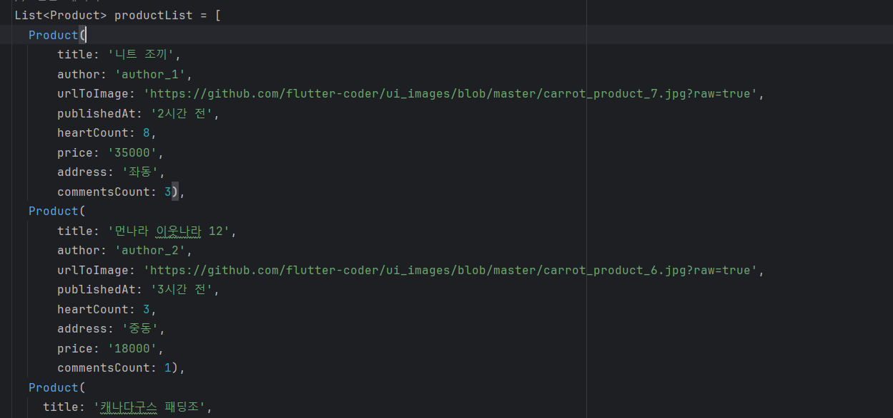
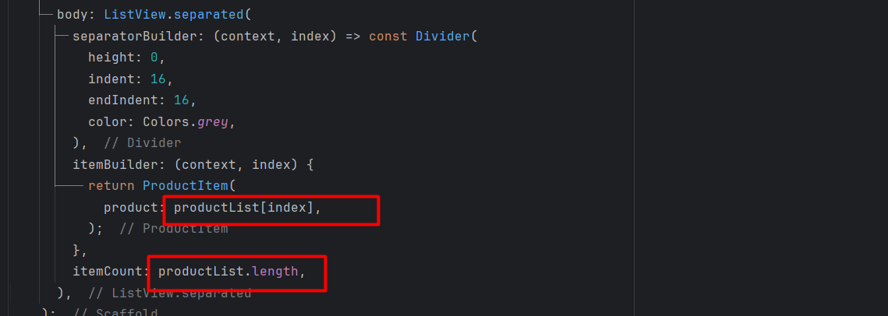

# Chapter 10 모두의 마켓 앱 만들기

### 완성 화면

## 1. IndexedStack 위젯
<aside>
💡 IndexedStack은 여러 자식 위젯을 겹쳐 쌓아두고, 그중 하나만을 화면에 표시하는 데 사용된다. 일반적인 스택(Stack) 위젯과는 다르게 IndexedStack은 화면에 표시될 자식 위젯의 인덱스를 지정하여 한 번에 하나의 자식만 표시할 수 있다. 나머지 자식들은 렌더링이 되지만 화면에 표시되지는 않는다.

IndexedStack 위젯의 주요 속성은 다음과 같다.

1. alignment: IndexedStack 내에서 비포지셔닝된(non-positioned) 자식 위젯들을 정렬하는 방식이다. 예를 들어, Alignment.center로 설정하면 자식 위젯들이 중앙에 정렬된다.

2. children: IndexedStack에 포함될 자식 위젯들의 리스트이다. 리스트에 포함된 모든 위젯은 동일한 크기를 가져야 하며, index에 지정된 값에 따라 하나의 위젯만 표시된다.

3. clipBehavior: 콘텐츠를 잘라내기하는 방법을 지정한다. Clip.none, Clip.hardEdge, Clip.antiAlias, Clip.antiAliasWithSaveLayer 중 하나로 설정할 수 있다.

4. index: 현재 화면에 표시할 자식 위젯의 인덱스를 지정한다. 인덱스가 null이거나 children 리스트의 범위를 벗어나면 아무 것도 렌더링되지 않는다.

5. sizing: 비포지셔닝된 자식 위젯의 크기를 결정하는 방식이다. StackFit.loose, StackFit.expand, StackFit.passthrough 중 하나로 설정할 수 있다.

6. textDirection: 텍스트 방향을 지정하여 AlignmentDirectional 또는 EdgeInsetsDirectional을 사용할 때 방향을 지정한다. TextDirection.ltr(왼쪽에서 오른쪽)과 TextDirection.rtl(오른쪽에서 왼쪽)이 있다.
</aside>
 

IndexedStack 위젯에 두 개의 페이지를 만든다.

버튼을 누르면 Index 값이 바뀌면서 다른 페이지가 표시되도록 한다.

버튼을 누르면 다른 페이지로 이동한다.

페이지가 빌드 될 때 콘솔에 빌드 여부를 출력한다.

콘솔에 두 개의 페이지가 한 번에 빌드가 된 것을 확인할 수 있다. 

## 2. BottomNavigationBar 위젯
<aside>
💡 BottomNavigationBar는 Flutter에서 화면 하단에 위치하여 여러 화면으로의 이동을 쉽게 할 수 있도록 도와주는 위젯이다. 일반적으로 앱의 주요 섹션 간의 전환을 위해 사용된다

BottomNavigationBar 위젯의 주요 속성은 다음과 같다.

1. items: BottomNavigationBar의 각 항목을 정의하는 BottomNavigationBarItem의 리스트. 각 항목은 아이콘과 라벨(텍스트)을 포함하며, 사용자가 선택할 수 있는 옵션을 나타낸다.

2. currentIndex: 현재 선택된 항목의 인덱스를 나타낸다. 이는 기본적으로 0으로 설정되지만, 현재 선택된 탭을 나타내기 위해 업데이트된다.

3. onTap: 사용자가 항목을 탭했을 때 호출되는 콜백 함수. 선택된 항목의 인덱스를 매개변수로 받아 처리할 수 있다.

4. type: BottomNavigationBarType을 지정하여 아이템이 고정된 크기로 표시될지(fixed) 또는 선택될 때 아이템이 확대되는지(shifting)를 결정한다. shifting 타입은 기본적으로 4개 이상의 항목이 있을 때 활성화된다.

5. selectedItemColor: 선택된 항목의 아이콘과 텍스트 색상을 설정할 수 있다.

6. unselectedItemColor: 선택되지 않은 항목의 아이콘과 텍스트 색상을 설정할 수 있다.
</aside>
 

IndexedStack 위젯의 _selectedIndex 와 BottomNavigationBar 위젯의 currentIndex를 연결한다.

IndexedStack 와 BottomNavigationBar 가 서로 연결되어 표시된다.

모든 페이지가 빌드된 것을 확인할 수 있다.

<aside>
💡BottomNavigationBar와 IndexedStack 는 사용자 경험을 높이기 위해 함께 자주 사용된다.
하지만 IndexedStack 는 모든 페이지를 빌드하기 때문에 선택하지 않은 페이지도 빌드가 되어 불필요한 데이터 통신이 발생할 수 있다. 따라서 상황에 맞게 활용해야 한다.
</aside>
 

## 3. 모델 클래스 만들기
<aside>
💡모든 기능을 갖춘 앱에서는 서버에서 JSON 기반 API 를 호출하여 데이터를 로드한다. 그리고 JSON 기반의 문자열 데이터를 해당 언어의 오브젝트(클래스)로 변환하는데 이때 필요한 클래스를 모델 클래스라고 한다.

지금은 통신할 서버가 없기 때문에 샘플 데이터를 만들어 화면에 바인딩한다.
</aside>
 

product 클래스와 생성자를 만든다.

product 클래스를 활용해 리스트 타입의 샘플 데이터를 만든다.

ListView 의 itemBuilder 속성을 통해 prooductList 의 각 인덱스를 빌드한다.

전달받은 데이터는 (모델 클래스의 변수명).(모델 클래스 내부의 필드명) 으로 바인딩한다.

## 4. Card 위젯
<aside>
💡Card 위젯은 콘텐츠를 그룹화하여 깔끔하고 정돈된 형태로 보여주기 위해 사용된다. 보통 다른 콘텐츠와 시각적으로 구분되도록 모서리가 둥근 사각형 형태를 띠며, 그림자(shadow)가 추가되어 있습니다.

 
Card 위젯의 주요 속성은 다음과 같다.

1. child: 카드 안에 배치할 단일 위젯이다. Column, Row 등을 사용하여 여러 위젯을 포함할 수 있다.
2. elevation: 카드의 그림자 깊이를 설정한다. 숫자가 클수록 더 진한 그림자가 나타난다.
3. shape: 카드의 모양을 지정할 수 있다. RoundedRectangleBorder를 사용하여 모서리 둥글기를 설정한다.
4. margin: 카드 주변의 외부 여백을 설정한다.
</aside>
 

Card에 들어갈 내부 데이터는 모델 클래스를 만들어 바인딩한다.

Card 위젯을 사용하면 원하는  콘텐츠를 깔끔하게 정리할 수 있어 사용자 경험을 향상시키고, 콘텐츠의 구조를 명확하게 전달할 수 있다.

## 5. PreferredSize 위젯
<aside>
💡 PreferredSize는 자식 위젯에게 특정한 크기(preferred size)를 부여하고자 할 때 사용된다. 주로 AppBar와 같은 위젯에 고정된 크기를 지정하는 데 사용되며, 특정 크기를 갖는 UI 요소를 생성하거나 배치할 때 유용하다.
</aside>
 

app의 크기를 조절할 수 있다.

## 6. Visibility 위젯
<aside>
💡 Visibility 위젯은 자식 위젯의 표시 여부를 제어하는 데 사용된다. 이 위젯을 통해 특정 위젯을 화면에 표시하거나 숨길 수 있으며, 숨긴 위젯의 공간을 유지할지 여부도 선택할 수 있다.

 
Visibility의 주요 속성은 다음과 같다.

1. visible: true일 때 자식 위젯이 화면에 표시된다. false일 때 자식 위젯이 화면에서 숨겨지지만, 위젯의 공간은 그대로 유지됩니다.

2. child: Visibility 위젯의 자식 위젯. visible 속성에 따라 이 위젯이 화면에 표시될지 결정된다.

3. replacement: visible이 false일 때, child 대신에 표시될 위젯. 이 속성을 설정하지 않으면 child가 숨겨질 때 빈 공간이 남는다.

4. maintainState: visible이 false일 때 자식 위젯의 상태를 유지할지 여부를 결정한다. true로 설정하면 자식 위젯이 비활성화되더라도 상태가 유지된다.

5. maintainAnimation: visible이 false일 때도 애니메이션을 유지할지 결정한다. 자식 위젯이 애니메이션을 포함하는 경우 사용한다.

6. maintainSize: visible이 false일 때도 자식 위젯의 크기를 유지할지 결정한다. 이 속성을 true로 설정하면, 자식 위젯이 보이지 않더라도 레이아웃에서의 크기를 유지한다.
</aside>
 

이미지 값이 null 이 아니면 visible 값이 true가 되어 이미지가 표시가 되고, null 이면 visible 값이 false가 되어서 이미지가 표시되지 않는다.

## 7. TextField 위젯
<aside>
💡 TextField 위젯은 사용자가 텍스트를 입력할 수 있는 기본적인 입력 위젯이다.

TextFormField 위젯과 유사한 기능을 한다. 하지만 TextFormField는 유효성 검사가 가능한 반면,  TextField는 유효성 검사나 form 상태 관리 등의 기능은 없다. 따라서 간단한 텍스트를 입력하는 경우에 적합하다.

</aside>
 

