# Chapter 11 사진 관리 앱 만들기 : 카메라 제어하기

## 1. 사진 촬영, 저장하기
<aside>
💡 플러터에서에서 카메라를 제어하려면 camera 패키지를 사용해야 한다. camera 패키지는 카메라를 직접 제어하진 않으나, 안드로이드나 ios 같은 호스트 운영 체제의 카메라 API에 접근하는 인터페이스를 제공한다.
</aside>
 

### 1.1 안드로이드 권한 부여하기
<aside>
💡 사진 촬영 앱을 만들 때, 촬영한 사진을 디바이스의 저장소에 저장하려면 쓰기 권한이 필요하다. 권한을 요청하고 관리하는 과정은 사용자의 프라이버시를 보호하고, 앱이 사용자의 데이터를 안전하게 취급하도록 하기 위한 중요한 보안 절차이다.
</aside>
 

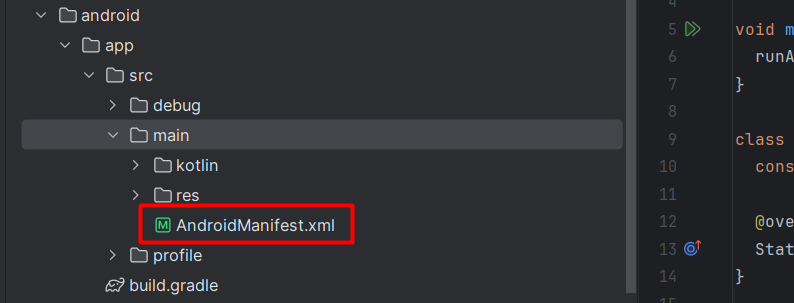

android/app/src/main/AndroidManifest.xml 

<aside>
💡 AndroidManifest.xml 파일은 안드로이드 앱의 올바른 동작을 위해 필수적이며, 앱의 권한 관리, 컴포넌트 등록, 하드웨어 요구사항 등을 명확하게 정의하는 역할을 한다.
</aside>
 

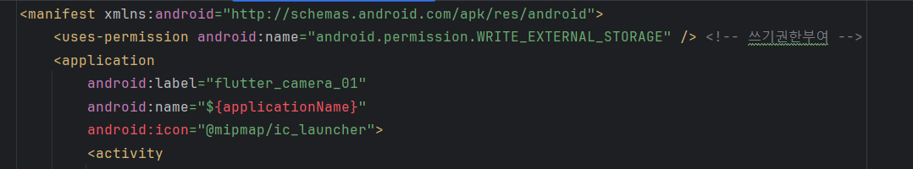

AndroidManifest.xml 에 쓰기 권한을 부여한다.

### 1.2 minSdkVersion 설정
<aside>
💡 minSdkVersion은 AndroidManifest.xml 파일이나 build.gradle 파일에서 설정하는 중요한 속성으로, 앱이 지원하는 최소 안드로이드 운영체제(API) 버전을 정의한다. 이 설정은 불필요한 오류나 비호환성 문제 예방, 개발 효율성 등을 위해 필요하다.
</aside>
 

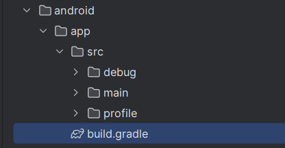

android/app/build.gradle

<aside>
💡 build.gradle 파일은 플러터 프로젝트에서 안드로이드 모듈의 빌드 설정을 관리하는 중요한 구성 파일이다. 이 파일은 안드로이드 앱의 컴파일, 빌드, 패키징 프로세스를 제어하며, 다양한 설정과 의존성을 정의할 수 있다.
</aside>
 

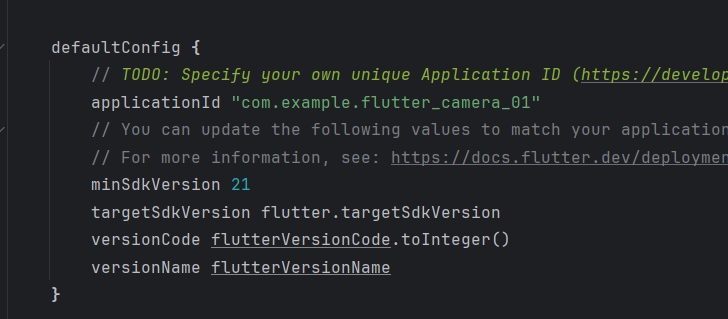

최소 버전을 21 로 설정한다.

### 1.3 camera 패키지 추가

https://pub.dev/packages/image_picker

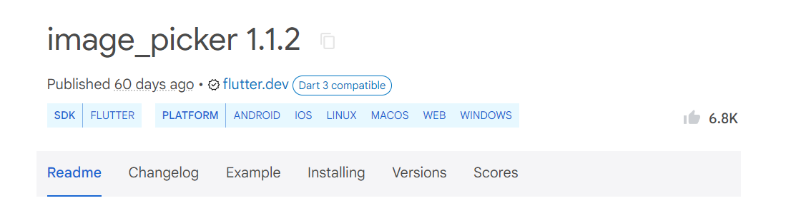

image_picker는 이미지를 선택하거나 카메라로 사진을 찍을 수 있도록 해주는 라이브러리다.

https://pub.dev/packages/gallery_saver

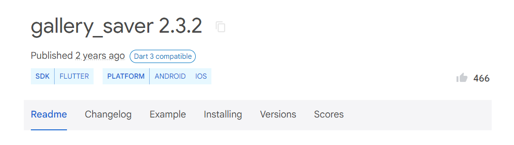

gallery_saver는 이미지를 디바이스에 저장하는 기능을 제공하는 라이브러리이다.

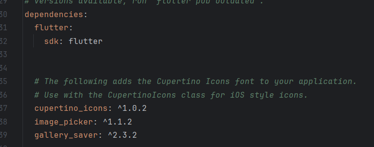

pubspec.yml 에 패키지를 추가한다.

### 1.4 촬영 기능 구현하기

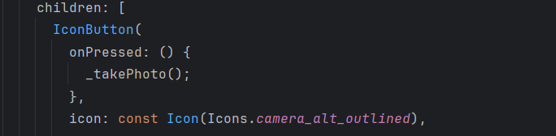

버튼을 클릭하면 사진 촬영 함수가 호출되도록 한다.

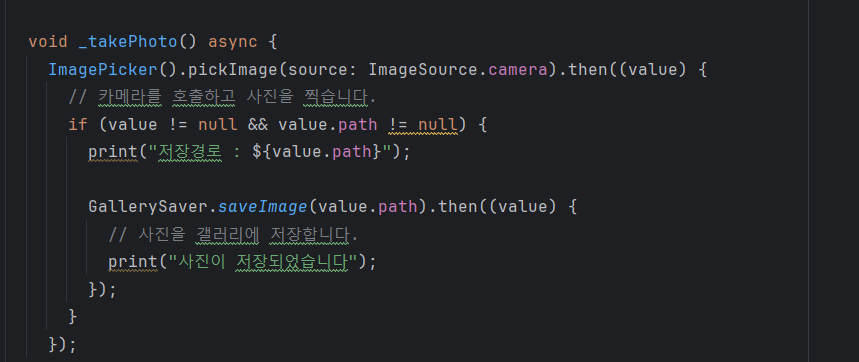

사진 촬영 함수를 구현한다.

<aside>
💡 async와 await 키워드는 비동기 프로그램에서 주로 사용된다. 

 
비동기 프로그램은 여러 작업이 진행될 때, 하나의 작업이 완료되기를 기다리지 않고 다음 작업을 계속 실행하는 방식이다.
시간이 오래 걸리는 작업은 이벤트 루프에 기록 후, 모든 작업이 완료가 되면 그때 이벤트 루프에 있는 작업을 다시 실행한다. 이런 단일 스레드 방식으로 효율적인 처리를 할 수 있다.

 
async 키워드를 사용하면 함수는 비동기적으로 실행된다. async 함수 내에서 await 키워드를 사용하면 비동기 작업이 완료될 때까지 기다린 후, 그 결과를 처리할 수 있다. await를 사용하지 않으면, 비동기 작업이 완료되기 전에 다음 코드가 실행될 수 있으며, 이는 의도하지 않은 동작이나 오류를 초래할 수 있다.

 

1. 사진 촬영 후 경로 확인: ImagePicker().pickImage 메서드는 사용자가 사진을 찍은 후에 파일의 경로를 반환하는데, 이는 비동기적으로 처리된다. await를 사용하여 사용자가 사진을 찍고 파일 경로가 반환될 때까지 기다린다.

2. 사진 저장: GallerySaver.saveImage 메서드는 비동기적으로 사진을 저장한다. 따라서 저장 작업이 완료되기 전에 다른 작업이 실행되지 않도록 await를 사용하여 완료를 기다린다.
</aside>
 

안드로이드스튜디오 툴은 카메라가 없어 임시 화면이 뜬다.

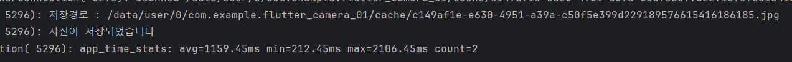

사진이 정상적으로 촬영, 저장되었다.

## 2. 사진 불러오기

### 2.1 읽기 권한 부여

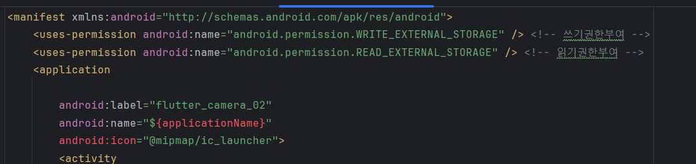

AndroidManifest.xml 에 읽기 권한을 설정한다.

