# 12. 상태 관리 앱 만들기 : RiverPod

## 1. RiverPod 란?

<aside>
💡 Riverpod은 Flutter에서 상태 관리를 위해 사용되는 상태 관리 라이브러리이다. Riverpod은 전역 상태와 지역 상태를 일관된 방식으로 관리할 수 있다. 전역 상태 관리와 특정 위젯 트리에 종속된 지역 상태 관리 모두를 지원하여, 다양한 상태 관리 요구사항을 충족할 수 있다.

</aside>
 

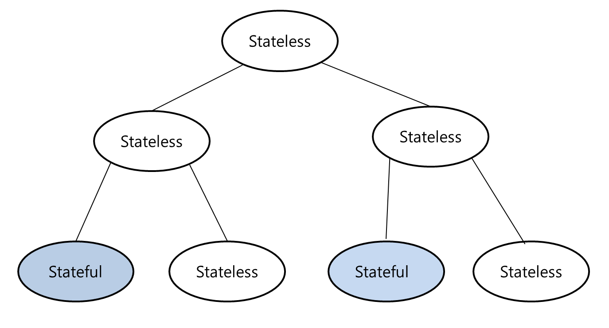

Stateful 위젯의 상태가 변경되면, 해당 Stateful 위젯의 하위 위젯은 전체가 rebuild된다.(다시 그려진다.)

만약 두 Stateful 위젯이 서로 상태를 공유해야 한다면 , 공유하고 있는 가장 상위의 부모 위젯이 Stateful 위젯이 되어야 한다.

.png>)

그림과 같이 두 위젯의 가장 가까운 부모 위젯이 Stateful 위젯이 되어야 한다. 하지만 이런 경우 단점이 있다.

1. 부모 위젯에서 상태와 메서드를 전달해야하기 때문에 트리가 깊어지면 매번 전달하는 귀찮음이 있다.
2. 부모가 rebuild가 되면 하위의 자식 위젯 전체가 다시 그려진다. 그래서 트리의 설계를 매우 잘해야 한다.

.png>)

RiverPod은 상태를 저장하는 공간을 따로 만들어 관리한다.

상태 관리를 외부 클래스에서 하게 되면 불필요한 rebuild를 방지할 수 있다.

## 2. RiverPod 패키지 설치

https://pub.dev/packages/flutter_riverpod

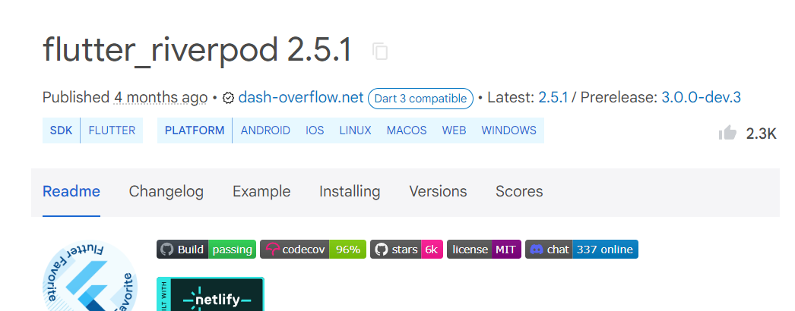

pub.dev 사이트에서 RiverPod 최신 버전을 확인한다.

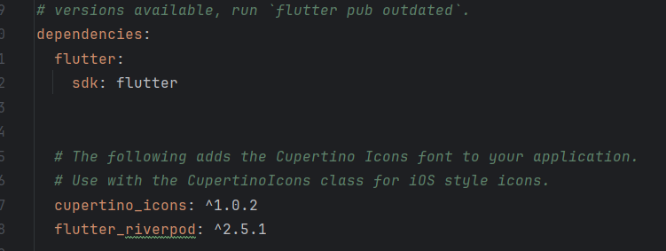

pubspec.yaml에 패키지를 설치한다.

## 3. Provider
<aside>
💡 Provider는 상태를 공유하고 액세스하는 것을 단순화하여 개발자가 더 쉽게 상태 관리를 할 수 있도록 도와준다.

Provider 는 지속적으로 상태 변화를 관찰하지 않고 최초 한번만 관찰한다. 최초 생성 시에 상태값을 가지게 되며, 해당 상태값을 통해 그림을 그린다. 이후 상태값이 변경된다 하더라도 그림은 다시 그려지지 않는다.
</aside>
 

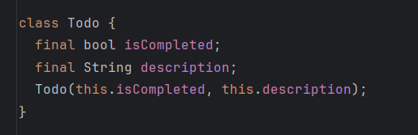

모델 클래스를 만든다.

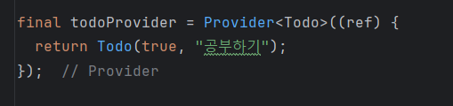

todo 객체를 관리하는 provider 를 만든다.

ref는 Riverpod에서 제공하는 객체로, 다른 프로바이더에 접근하거나 현재 프로바이더의 상태를 재생성하는 등의 역할을 할 수 있다.

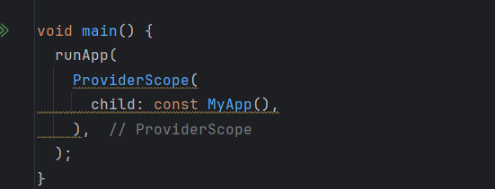
 
 RiverPod을 사용하기 위해 최상위 위젯인 MyApp을 ProviderScope 로 감싼다.

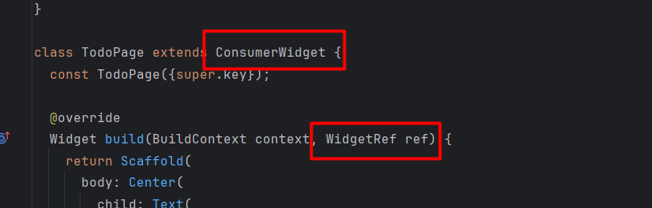

<aside>
💡 ConsumerWidget는 Riverpod에서 제공하는 위젯 타입으로, 상태 소비(Consumer)와 관련된 기능을 제공한다. 이 위젯은 Riverpod의 상태를 구독하고, 그 상태가 변경될 때 자동으로 다시 빌드되는 위젯을 만드는 데 사용된다.

 
WidgetRef는 ConsumerWidget의 build 메서드에서 전달되는 매개변수로, 이 객체를 통해 Provider에서 제공하는 상태에 접근할 수 있다.
</aside>
 

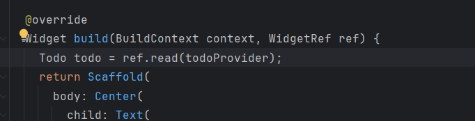

todo 객체에 접근하기 위해 ref.read를 사용해 Provider 에 접근한다. 

<aside>
 💡ref.read 는 상태를 읽어오는 시점에 한 번만 접근하며, 이후 상태가 변경되더라도 다시 상태를 관찰하지 않는다.
</aside>
 

 
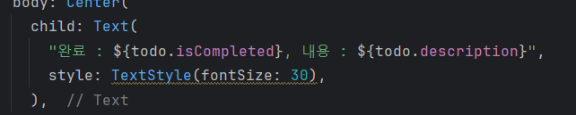

Provider 를 통해 접근한 todo 객체를 화면에 바인딩한다.

 

## 3. StateNotifierProvider
<aside>
💡 StateNotifierProvider 상태가 변경될 때 변경을 감지하여 참조하는 위젯에게 알려준다. 위젯이 상태를 구독할 경우 상태갓ㅂ이 변경될 때 마다 해당 위젯이 다시 그려진다.
</aside>
 

 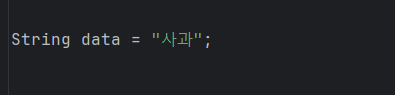

 현재 '사과' 라는 데이터를 가지고 있다.

 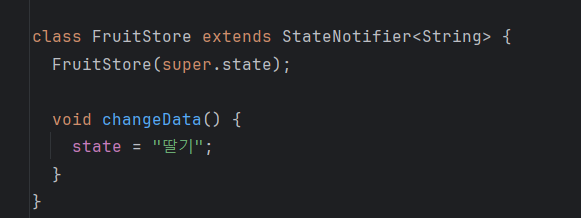

<aside>
 💡FruitStore 클래스를 만든다. FruitStore 클래스는 StateNotifier를 상속받아 String 타입의 상태를 관리하는 상태 관리자이다.

  state는 StateNotifier 클래스의 멤버로, 현재 상태를 나타내며, state가 변경될 때마다 구독 중인 모든 위젯에 상태 변경이 반영된다.
</aside>
 

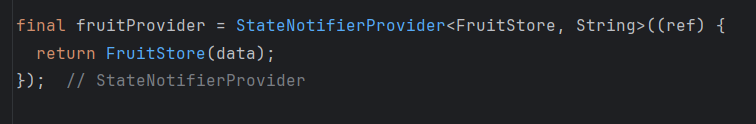

<aside>
 💡모델 클래스를 관리하기 위해 fruitProvider를 만든다. fruitProvider는 <FruitStore,String> 타입을 변수로 받으며, FruitStore는 StateNotifier를 상속한 상태 관리자, String은 모델 클래스의 타입이다.

 fruitProvider가 호출되면 상태 관리자(FruitStore)가 상태(String)에 접근해 상태를 관리한다.
</aside>
 

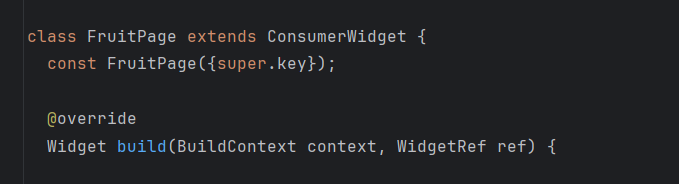

위젯을 ConsumerWidget 으로 변경 후 ref 매개변수를 추가한다.

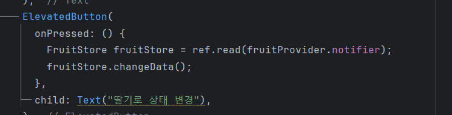

버튼을 선택하면 fruitProvider에 접근해 상태값을 바꾼다.

<aside>
 💡StateNotifierProvider를 사용하여 상태를 관리할 때, ref.read를 통해 상태를 읽을 수 있지만, StateNotifier 인스턴스에 직접 접근하려면 .notifier를 사용해야 한다. .notifier를 통해 fruitStore에 접근한다.
</aside>
 

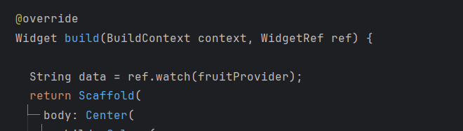

ref.watch를 활용해 fruitProvider에 접근, 상태를 구독한다.

<aside>
 💡ref.watch는 프로바이더의 상태를 구독하고, 상태가 변경될 때마다 자동으로 리빌드(rebuild)하는 데 사용되는 메서드이다. 이를 통해 UI가 항상 최신 상태를 반영하도록 할 수 있다.
</aside>
 

 
 
