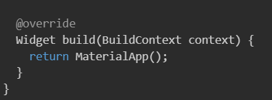
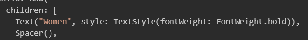

# Chapter 04 스토어 앱 만들기

### 완성 화면

### 주요 위젯 구성

## 1. MaterialApp vs CupertinoApp

<aside>
💡 MaterialApp : google의 Material Design을 따르며, Android 앱을 만들기 위해 사용한다. Scaffold, AppBar, FloatingActionButton, Drawer 등 다양한 Material Design 위젯을 제공하며, ThemeData를 사용하여 앱의 전반적인 테마를 설정할 수 있다.
 
 
CupertinoApp : Apple의 Cupertino 디자인을 따르며, ios 앱을 만들기 위해 사용한다. CupertinoPageScaffold, CupertinoNavigationBar, CupertinoButton 등 다양한 Cupertino 스타일 위젯을 사용할 수 있다.

</aside>
 

안드로이드 앱을 만들기 위해 MaterialApp 을 사용한다.

## 2. Scaffold

<aside>
💡 `Scaffold`는 기본적인 Material Design의 시각적 레이아웃 구조를 구현하는 위젯이다. 앱의 기본적인 디자인 구조를 제공하며, 드로어(drawers), 바텀 시트(bottom sheets), 플로팅 액션 버튼(FloatingActionButton) 등 다양한 API를 제공한다. 이를 통해 기능적이고 반응형 앱을 쉽게 만들 수 있다.

---

</aside>

- **앱 바(AppBar): 상단에 앱 바를 추가하여 앱의 제목이나 액션 버튼을 표시할 수 있다.**
- **바디(Body): 앱의 주요 콘텐츠를 표시하는 영역. 다양한 위젯을 바디에 배치하여 앱의 주요 기능을 구현할 수 있다.**
- **플로팅 액션 버튼(FloatingActionButton): 화면에 고정된 액션 버튼을 추가하여 사용자가 중요한 작업을 쉽게 수행할 수 있도록 도와준다.**

 

MaterialApp 내부에 Scaffold 위젯을 구현해 기본 뼈대를 만든다.
Scaffold 로 감싸는 순간 휴대폰 화면에 구조가 만들어지고 쉽게 앱을 만들 수 있다.

## 3. Column , Row

### 3.1 Column 위젯
<aside>
Column 위젯은 자식 위젯을 수직으로 배치한다. 

- children 속성을 가지고 있으며, 이는 여러 개의 자식 위젯을 받을 수 있다.(child 속성은 하나의 자식 위젯만 가질 수 있다.)
- mainAxisAlignment 속성은 Column의 메인축(수직 방향)에 대한 배치를 조정한다.
- crossAxisAlignment 속성은 교차축(수평 방향)에 대한 배치를 조정한다.
</aside>

### 3.2 Row 위젯

<aside>
Row 위젯은 자식 위젯을 수평으로 배치한다. 

- children 속성을 가지고 있으며, 이는 여러 개의 자식 위젯을 받을 수 있다.(child 속성은 하나의 자식 위젯만 가질 수 있다.)
- mainAxisAlignment 속성은 Row의 메인축(수평 방향)에 대한 배치를 조정한다.
- crossAxisAlignment 속성은 교차축(수직 방향)에 대한 배치를 조정한다.

</aside>

 

<aside>
💡 앱의 전체 위젯은 세로 배치가 되지만 메뉴 부분은 Row 를 사용해 가로 배치를 한다.
</aside>

## 4. Text 위젯

<aside>
💡 Text 위젯은 문자열을 담을 수 있는 위젯이다. style , textAlign, overflow 등의 속성을 통해 텍스트의 스타일과 배치를 조정할 수 있다.
</aside>
 

## 5. Spacer 위젯 
<aside>
💡 Spacer 위젯은 레이아웃의 특정 위치에 빈 공간을 생성하는데 사용한다. 주로 Row 위젯이나 Column 위젯의 자식 위젯 사이에 일정한 간격을 추가할 때 사용한다.
</aside>
 

## 6. Image 위젯
<aside>
💡 Image 위젯은 이미지를 표시하는데 사용한다. 
주요 속성 중 fit 속성이 있으며 위젯의 영역에 어떻게 맞출지를 결정한다. 종류는 다음과 같다.

1. BoxFit.fill: 이미지를 위젯의 크기에 맞게 왜곡한다.
2. BoxFit.contain: 이미지를 비율을 유지하면서 위젯 내부에 맞춘다.
3. BoxFit.cover: 이미지를 비율을 유지하면서 위젯을 완전히 덮도록 맞춘다.
4. BoxFit.fitWidth: 너비에 맞게 이미지를 비율을 유지하면서 맞춘다.
5. BoxFit.fitHeight: 높이에 맞게 이미지를 비율을 유지하면서 맞춘다.
6. BoxFit.none: 원본 크기로 이미지를 표시한다.
7. BoxFit.scaleDown: 원본 크기보다 크면 축소하여 맞춘다.
</aside>
 

## 7. Expanded 위젯
<aside>
💡 Expanded 위젯은 남은 위젯을 공간을 확장하여 공간을 채울 수 있도록 하는 위젯이다. Column, Row 등의 위젯에서 사용되어 가변적으로 공간을 차지할 수 있게 한다.
</aside>
 

- Expanded 사용하지 않았을 때

 

- Expanded 사용했을 때 

## 8. SizedBox 위젯
<aside>
💡 SizedBox 위젯은 특정 크기의 상자를 만드는데 사용하는 위젯이다.
height, width 와 같은 속성으로 크기를 지정해 위젯 사이의 간격을 조정할 수 있다.
</aside>
 

## 9. Padding 위젯 
<aside>
💡 Padding 위젯은 자식 위젯의 여백을 주는데 사용한다. 

- EdgeInsets.all 속성은 상하좌우에 동일한 여백을 줄 때 사용한다.
- EdgeInsets.symmetric 속성은 좌우, 상하를 나누어 다른 여백을 줄 때 사용한다.
- EdgeInsets.only 속성은 한 방향의 여백을 줄 때 사용한다.
</aside>
 

