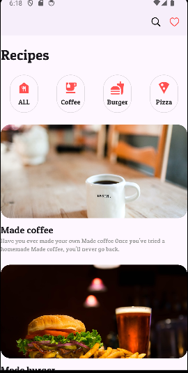

# Chapter 05 레시피 앱 만들기

### 완성 화면

  
  

### 주요 화면 구성

## 1. AppBar 위젯
<aside>

💡 AppBar는 애플리케이션의 상단에 위치하는 툴바(툴바, 내비게이션 바 또는 타이틀 바라고도 불림)이다. AppBar는 일반적으로 애플리케이션의 제목, 내비게이션 아이콘, 메뉴 아이콘, 액션 버튼 등을 포함할 수 있으며, 화면 간의 내비게이션과 사용자 상호 작용을 도와준다.

AppBar의 주요 구성 요소는 다음과 같다.

1. leading: 주로 왼쪽의 내비게이션 버튼을 배치하는 위치. 일반적으로 햄버거 메뉴 아이콘이나 뒤로 가기 버튼을 여기에 배치한다.
2. title: 앱바의 중앙에 표시되는 제목이다. 텍스트나 로고 등을 표시할 수 있다.
3. actions: 앱바의 오른쪽에 위치하며, 아이콘 버튼이나 드롭다운 메뉴 등을 배치할 수 있다.
4. backgroundColor: 앱바의 배경색을 설정한다.
5. elevation: 앱바의 그림자 깊이를 설정한다.
6. centerTitle: 제목을 중앙에 정렬할지 여부를 설정한다.
</aside>

 

## 2. Icon 위젯
<aside>
 💡 Icon 위젯은 애플리케이션에서 아이콘을 표시하는 데 사용된다. Icon 위젯은 주로 Icons 클래스 또는 IconData 객체를 통해 정의된 아이콘을 표시하며, 다양한 속성을 통해 스타일을 설정할 수 있다.

Icon 위젯의 주요 속성은 다음과 같다.

1. icon: 표시할 아이콘을 정의하는 IconData 객체. 예를 들어, Icons.home, Icons.settings 등.
2. size: 아이콘의 크기를 설정하는 double 값이다.
3. color: 아이콘의 색상을 설정하는 Color 객체
4. textDirection: 아이콘의 텍스트 방향을 설정하는 TextDirection 객체입니다.

</aside>
 

AppBar의 actions 속성을 활용해 아이콘을 오른쪽에 배치시킨다.

## 3. Container 위젯

<aside>
💡 Container 위젯은 가장 많이 사용되는 위젯 중 하나로, 여러 기능을 제공하여 다양한 레이아웃과 스타일을 구성하는 데 도움을 준다. Container 위젯은 박스 모델(Box Model)을 기반으로 동작하며, 배경색, 테두리, 크기, 여백, 패딩 등 다양한 스타일을 지정할 수 있다.

Container 위젯의 주요 속성은 다음과 같다.

1. alignment: 자식 위젯의 정렬을 설정한다.
2. padding: 자식 위젯 주위의 내부 여백을 설정한다.
3. margin: 컨테이너 주위의 외부 여백을 설정한다.
4. color: 배경 색상을 설정한다.
5. decoration: 컨테이너의 배경, 테두리 및 그림자를 설정하는 데 사용한다. BoxDecoration 객체를 사용하여 더 많은 스타일 옵션을 제공한다.
6. height 및 width: 컨테이너의 크기를 설정한다.
7. constraints: 추가적인 크기 제약 조건을 설정한다.
8. child: 컨테이너 내부에 포함될 위젯을 설정한다.

</aside>
 

컨테이너의 색깔, 크기, 둥근 정도를 조정할 수 있다.

컨테이너 내부에 child 속성을 활용해 다른 위젯을 자식 위젯으로 사용할 수 있다. Column 위젯을 사용해 아이콘과 텍스트를 세로로 배치한다.

## 4. ListView 위젯 

<aside>
💡 ListView 위젯은 Flutter에서 스크롤 가능한 목록을 표시하는 데 사용되는 가장 기본적인 위젯이다. ListView는 자식 위젯들을 스크롤 가능한 목록으로 구성할 수 있게 해주며, 수직 또는 수평으로 스크롤할 수 있다.

ListView 위젯은 다양한 생성자와 옵션을 제공하여 다양한 요구를 충족시킬 수 있습니다. 주요 생성자는 다음과 같다.

1. ListView: 기본적인 리스트 뷰로, 자식 위젯 목록을 직접 전달받는다.
2. ListView.builder: 필요할 때마다 항목을 동적으로 생성하는 리스트 뷰로, 대량의 데이터나 무한 스크롤을 처리할 때 유용하다.
3. ListView.separated: 항목 사이에 구분선 또는 다른 위젯을 삽입할 수 있다.
4. ListView.custom: 사용자 정의된 방식으로 항목을 생성할 수 있다.
</aside>

- ListView 속성

리스트 뷰를 사용해 스크롤을 사용할 수 있다.

- ListView.build 속성 

ListView.build 속성을 사용하면 List의 크기 만큼 반복적으로 데이터를 출력할 수 있다. itemCount 의 값 만큼 리스트 뷰 항목이 출력된다.

## 5. AspectRatio 위젯

<aside>
💡 AspectRatio 위젯은 자식 위젯이 특정 종횡비를 유지하도록 크기를 조정하는 데 사용된다. 종횡비는 너비와 높이의 비율로 정의되며, aspectRatio 속성에 의해 설정된다.

AspectRatio 위젯의 주요 속성은 다음과 같다.

1. aspectRatio: 종횡비를 설정하는 double 값. 예를 들어, 16:9 종횡비는 aspectRatio: 16/9로 설정할 수 있다.
2. child: 종횡비를 유지하면서 크기를 조정할 자식 위젯

</aside>
 

가로 2 / 세로 1의 비율로 설정했다.

## 6. ClipRRect 위젯

<aside>
💡 ClipRRect 위젯은  자식 위젯을 둥근 모서리가 있는 직사각형으로 잘라내기 하는 데 사용된다. 이 위젯은 자식 위젯의 모서리를 둥글게 만드는 데 유용하며, 특히 이미지를 둥근 모서리로 표시할 때 자주 사용된다.

ClipRRect 위젯의 주요 속성은 다음과 같다.

1. borderRadius: BorderRadius 객체를 사용하여 직사각형의 모서리를 얼마나 둥글게 할지를 설정한다.
2. clipBehavior: 클리핑 동작을 제어한다. 기본값은 Clip.antiAlias이며, 이 외에도 Clip.hardEdge, Clip.3. antiAliasWithSaveLayer 등을 사용할 수 있다.
3. child: 클리핑할 자식 위젯이다.

</aside>

