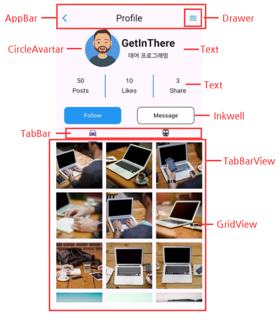
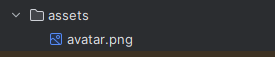
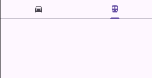
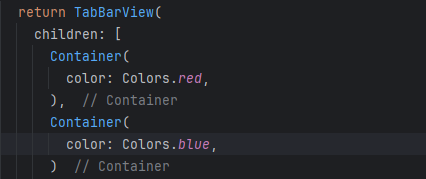
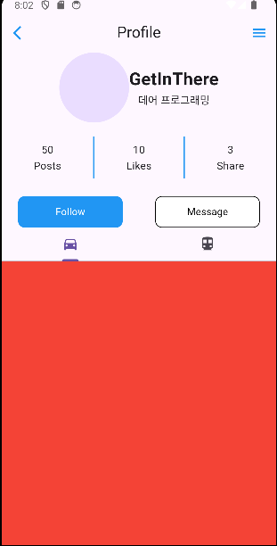
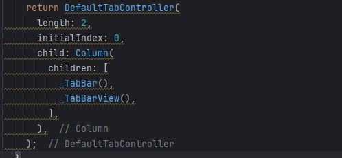
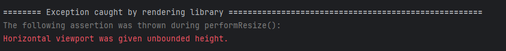
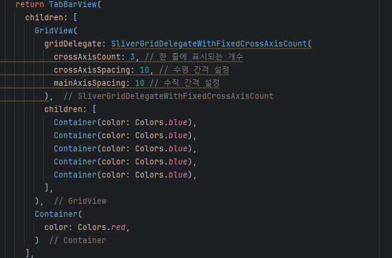
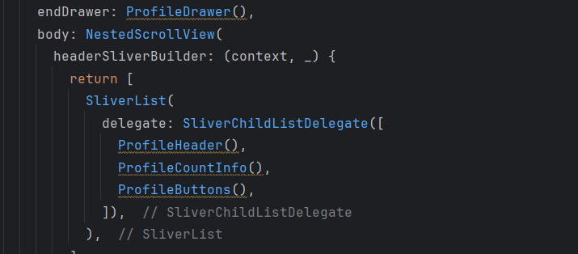

# Chapter 06 프로필 앱 만들기

### 완성 화면

  
  
  

### 주요 화면 구성

## 1. Drawer 위젯
<aside>
💡 Drawer 위젯은 앱의 측면에서 슬라이딩되어 나오는 내비게이션 메뉴를 만드는 데 사용된다. 일반적으로 Scaffold 위젯과 함께 사용되며, 앱의 주된 내비게이션 구조를 제공하는 데 유용하다. Drawer는 왼쪽이나 오른쪽에서 슬라이딩하여 열리며, 사용자가 쉽게 앱 내의 다른 섹션으로 이동할 수 있도록 도와준다.

Drawer 위젯의 주요 속성은 다음과 같다.
- child: Drawer 위젯 내부에 표시될 콘텐츠를 설정한다. 일반적으로 ListView나 Column을 사용하여 여러 항목을 배치한다.
</aside>

 

  
  

Drawer 의 크기와 색상을 조정할 수 있다.

## 2. CircleAvartar 위젯 
<aside>
💡 CircleAvatar는 Flutter에서 원형 프로필 이미지를 표시하는 데 사용되는 위젯이다. 보통 사용자 프로필 사진이나 아이콘을 원형으로 표시할 때 사용한다. CircleAvatar는 backgroundImage 속성을 통해 이미지를 설정하거나, child 속성을 통해 다른 위젯을 자식으로 포함할 수 있다.

CircleAvatar 의 주요 속성은 다음과 같다.

1. backgroundColor: 원형 배경의 색상을 설정한다.
2. backgroundImage: 원형 배경에 표시할 이미지를 설정한다. ImageProvider 타입을 사용한다.
3. child: 원형 안에 포함될 위젯을 설정한다. 일반적으로 아이콘이나 텍스트를 사용한다.
4. radius: 원형의 반지름을 설정한다.
5. foregroundColor: 자식 위젯의 색상을 설정한다.
</aside>
 

## 3. AssetsImage 클래스

<aside>
💡  AssetImage는  assets으로 포함된 이미지를 로드하는 데 사용되는 클래스이다. assets은 프로젝트에 포함된 정적 파일로, 이미지, 폰트, JSON 파일 등 다양한 유형의 파일을 포함할 수 있다. AssetImage는 이러한 애셋 이미지를 로드하여 Image 위젯이나 CircleAvatar와 같은 위젯에 표시할 수 있다.
</aside>
 

pubspec.yaml 에서 assets 경로를 설정 후 pub get을 한다.

assets 폴더에 원하는 이미지, 폰트 등의 파일을 넣는다.

## 4. Inkwell 위젯

<aside>
💡 InkWell 위젯은 Flutter에서 터치(탭) 상호작용을 추가하는 데 사용되는 위젯이다. 주로 버튼처럼 동작하지만, 원하는 모든 위젯에 터치 효과를 추가할 수 있다. InkWell은 물결(wave) 애니메이션 효과를 제공하여 터치 피드백을 시각적으로 제공한다. 이를 통해 터치가 인식되었음을 사용자에게 알릴 수 있다.

InkWell 위젯의 주요 속성은 다음과 같다.

1. onTap: 위젯이 탭되었을 때 호출되는 콜백 함수
2. onDoubleTap: 위젯이 더블탭되었을 때 호출되는 콜백 함수
3. onLongPress: 위젯이 길게 눌렸을 때 호출되는 콜백 함수
4. onTapCancel: 탭이 취소되었을 때 호출되는 콜백 함수
5. onTapDown: 탭이 시작되었을 때 호출되는 콜백 함수
6. child: InkWell 위젯 내부에 포함될 자식 위젯
7. borderRadius: 물결 효과의 경계선을 둥글게 만들기 위해 사용된다.
8. customBorder: 사용자 정의 모양의 경계를 설정할 수 있다.
</aside>
 

Container 위젯을 InkWell 위젯으로 감싸면 버튼 디자인을 자유롭게 만들 수 있다..

Inkwell 버튼을 누르면 OnTap 함수가 호출되면서 함수 내부가 실행된다.

## 5. TabBar 위젯

<aside>
💡 TabBar는 여러 화면을 탭으로 구성할 수 있는 위젯이다. 각 탭을 클릭하면 다른 화면이 표시되며, 일반적으로 TabBar와 TabBarView를 함께 사용하여 구현한다. TabBar는 탭 버튼들을 표시하고, TabBarView는 각 탭에 해당하는 콘텐츠를 표시힌다. 이 두 위젯은 보통 DefaultTabController와 함께 사용하여 탭 전환 상태를 관리한다.

TabBar의 주요 구성 요소는 다음과 같다.

1. TabBar: 탭 버튼을 표시하는 위젯이다.
2. TabBarView: 각 탭에 대응하는 콘텐츠를 표시하는 위젯이다.
3. DefaultTabController: 탭과 관련된 상태를 관리하는 컨트롤러이다. DefaultTabController 를 통해 탭 전환을 간편하게 구현할 수 있다.
</aside>
 

### 5.1 TabBar

TabBar 의 tabs 속성을 활용해 각 탭을 정의할 수 있다.

### 5.2 TabBarView

TabBarView 로 각 탭바에 대한 컨텐츠를 구성할 수 있다.

### 5.3 DefaultTabController

length 를 통해 탭바의 개수를 정할 수 있다. Column을 자식 위젯으로 사용해 TabBar 와 TabBarView를 쉽게 구현할 수 있다.

### 5.4 Horizontal viewport was given unbounded height 오류

<aside>
💡 ListView, GridView, PageView 등의 스크롤 가능한 위젯을 사용하면서 발생할 수 있다. 주로 부모로부터 고정된 크기를 받지 못했을 때 주로 한다. 이런 오류가 발생했을 때는 Expanded 위젯을 사용해 나머지 공간을 채울 수 있도록 만들어야 한다.
</aside>
 

TabBarView 를 Expanded 로 감싸 남은 공간을 차지하도록 설정한다.

## 6. GridView 위젯

### 6.1 GridView
<aside>
💡 GridView는 Flutter에서 그리드 레이아웃을 구성하는 데 사용되는 스크롤 가능한 위젯이다. 이 위젯을 사용하면 2차원 스크롤 가능한 그리드를 쉽게 구현할 수 있다. GridView는 여러 개의 생성자를 제공하여 다양한 방식으로 그리드를 구성할 수 있다.

 
GridView의 주요 속성은 다음과 같다.

1. gridDelegate: 그리드 레이아웃을 정의하는 데 사용된다. 일반적으로 SliverGridDelegateWithFixedCrossAxisCount 또는 SliverGridDelegateWithMaxCrossAxisExtent를 사용한다.
2. children: 그리드에 표시될 위젯 목록이다. GridView 생성자 중 하나인 GridView.count와 함께 사용된다.
3. itemCount: 그리드에 표시될 항목의 개수를 설정한다. GridView.builder와 함께 사용된다.
4. itemBuilder: 각 항목을 생성하는 빌더 함수. GridView.builder와 함께 사용된다.

 
GridView의 주요 생성자는 다음과 같다.

1. GridView.count: 고정된 열 수를 사용하여 그리드를 구성한다.
2. GridView.extent: 각 항목의 최대 크기를 기준으로 그리드를 구성한다.
3. GridView.builder: 그리드 항목을 동적으로 생성할 때 사용한다.
4. GridView.custom: 사용자 정의된 그리드 항목을 구성할 때 사용한다.
</aside>
 

### 6.2 SliverGridDelegateWithFixedCrossAxisCount

<aside>
💡 SliverGridDelegateWithFixedCrossAxisCount는 Flutter에서 그리드 레이아웃을 정의할 때 사용되는 SliverGridDelegate의 서브클래스 중 하나이다. 이 클래스는 고정된 열의 개수를 사용하여 그리드 레이아웃을 배치한다. 이를 통해 각 항목의 크기를 자동으로 계산하고, 그리드의 모양을 결정할 수 있다.

 
SliverGridDelegateWithFixedCrossAxisCount 주요 속성은 다음과 같다.

1. crossAxisCount: 그리드의 열 개수를 설정한다.
2. mainAxisSpacing: 그리드 항목 간의 수직 간격을 설정한다.
3. crossAxisSpacing: 그리드 항목 간의 수평 간격을 설정한다.
4. childAspectRatio: 그리드 항목의 가로와 세로 비율을 설정한다.
</aside>
 

## 7. NestedScrollView

<aside>
💡 NestedScrollView는 안드로이드 개발에서 사용되는 스크롤 뷰의 일종으로, 주로 하위 뷰가 서로 중첩된 경우에 사용한다. 이 뷰는 ScrollView와 비슷하지만, 중첩된 스크롤 뷰와 잘 작동하도록 설계되어있다. 이를 통해 사용자 인터페이스에서 스크롤 가능한 자식 뷰들이 중첩된 경우에도 부드러운 스크롤을 제공한다.

 
NestedScrollView의 속성은 다음과 같다.

1. controller: 스크롤을 제어하는 데 사용.
2. scrollDirection: 스크롤 방향을 설정.
3. reverse: 스크롤 방향을 반대로 설정.
4. physics: 스크롤 동작을 정의.
5. headerSliverBuilder: 슬리버 헤더를 빌드.
6. body: 스크롤 가능한 본문 위젯.
7. dragStartBehavior: 드래그 시작 동작을 정의.
8. floatHeaderSlivers: 슬리버 헤더를 떠 있도록 설정.

</aside>
 

<aside>
💡 SliverList는 Flutter에서 Sliver 위젯 중 하나로, 스크롤 가능한 영역 안에 여러 개의 자식 위젯을 배치하는 데 사용한다. SliverList는 주로 CustomScrollView나 NestedScrollView와 함께 사용되어 유연하고 성능이 좋은 스크롤 인터페이스를 만들 수 있다.

 
SliverList는 속성은 다음과 같다.

1. SliverChildListDelegate: 고정된 리스트를 처리하는 데 사용된다.
2. SliverChildBuilderDelegate: 동적으로 생성된 리스트를 처리하는 데 사용된다.

</aside>
 

NestedScrollView 를 사용하면 탭바를 제외한 부분이 스크롤을 공유하게 되어 UX가 좋아진다.