# Chapter 07 로그인 앱 만들기

### 완성 화면

### 주요 위젯 구성

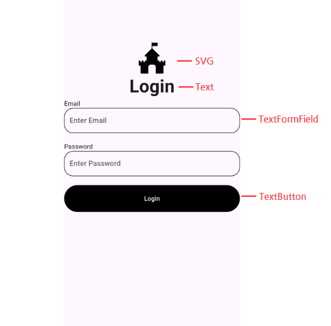

## 1. Route 만들기
<aside>
💡 Route는 앱 내에서 페이지 전환을 관리하는 객체를 의미한다. Route는 새로운 화면을 표시할 때 사용되며, Navigator를 통해 관리된다. 이를 통해 애니메이션, 상태 관리 및 사용자 경험을 제어할 수 있다.

 
이름은 규칙에 따라 경로와 유사한 구조를 사용한다. 이런 방식을 네이게이터 경로 사용법이라고 한다.
</aside>
 

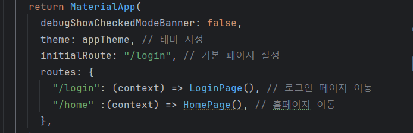

경로의 이름을 설정한다. initialRoute 를 사용하면 기본 경로를 설정할 수 있다.

## 2. SVG 파일 넣기
<aside>
💡 SVG(Scalable Vector Graphics)는 XML 기반의 파일 포맷으로, 벡터 그래픽을 표현하는 데 사용된다. 벡터 그래픽은 픽셀 단위가 아닌 수학적 좌표와 기하학적 도형으로 이미지나 그래픽을 정의하기 때문에, 크기 조절을 하더라도 해상도 저하 없이 선명하게 유지된다.

 
플러터에서 SVG 파일을 사용하기 위해 flutter_svg 라이브러리 설치가 필요하다.

 
flutter_svg 라이브러리의 SvgPicture 위젯을 사용하여 SVG 파일을 화면에 표시할 수 있다. SvgPicture는 여러 가지 생성자를 제공하지만, 주로 asset과 network 생성자가 많이 사용된다.

1. asset: 로컬 자산에서 SVG 파일을 로드한다.
2. network: 네트워크에서 SVG 파일을 로드한다.
3. file: 파일 시스템에서 SVG 파일을 로드한다.
4. string: 문자열 형식의 SVG 데이터를 로드한다.
5. width, height: SVG 이미지의 너비와 높이를 설정한다.
6. color: SVG 이미지의 색상을 변경한다.
7. fit: BoxFit 속성을 사용하여 SVG 이미지의 크기와 위치를 조정한다.
</aside>
 

https://pub.dev/packages/flutter_svg

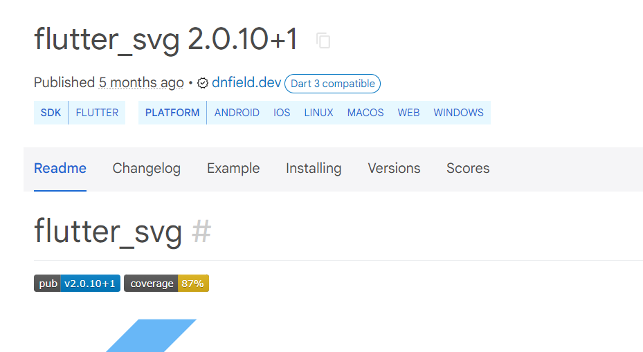

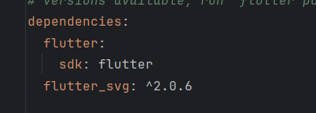

pubspec.yaml 에서 라이브러리를 등록 후 pub get 을 한다.

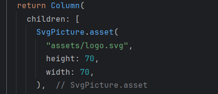

assets 폴더에 있는 logo.svg 파일을 출력한다.

## 3. TextFormField 위젯
<aside>
💡 TextFormField는 Flutter에서 폼(Form) 위젯을 만들기 위한 텍스트 입력 필드이다. validator 속성을 사용하여 입력값을 검증할 수 있다.

 
주요 속성은 다음과 같다.

1. controller: TextEditingController를 통해 텍스트 필드의 값을 제어하고 접근할 수 있다.
2. initialValue: 필드의 초기값을 설정한다.
3. decoration: InputDecoration을 사용하여 입력 필드의 외형을 꾸밀 수 있다.
4. validator: 입력값을 검증하는 함수
5. onSaved: 폼이 저장될 때 호출되는 함수
6. keyboardType: 입력할 때 사용하는 키보드 타입을 설정한다.
7. obscureText: 비밀번호 입력 필드와 같이 텍스트를 숨긴다.
</aside>
 

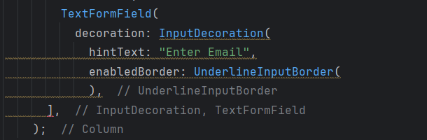

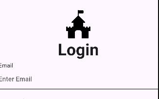

UnderlineInputBorder 를 사용하면 밑줄만 표시할 수 있다.

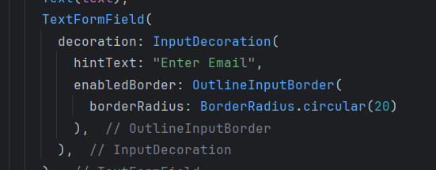

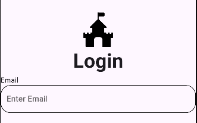

OutlineInputBorder 를 사용하면 전체 테두리가 표시된다.

이벤트 발생시의 디자인을 설정할 수도 있다.

## 4. Form 위젯
<aside>
💡 Form 위젯은 사용자가 입력한 데이터를 저장하고 유효성 검사를 하는 기능을 제공하는 위젯이다. 주로 여러 개의 입력 필드(TextFormField)를 그룹화하고, 폼 검증과 제출을 관리하는 데 사용된다. 즉 Form 위젯 안에 TextFormField 를 여러개  추가하여 사용자 입력을 받고 입력 받은 데이터를 한 번에 전송할 수 있다.

Form 위젯의 주요 속성은 다음과 같다.
1. key: 폼의 상태를 추적하기 위해 사용되는 키. 보통 GlobalKey<FormState>와 함께 사용된다.
2. child: 폼의 자식 위젯을 정의한다. 보통 여러 TextFormField나 커스텀 입력 필드 위젯들이 포함된다.
3. autovalidateMode: 폼 필드의 유효성 검사를 자동으로 수행하는 모드를 지정한다.

Form 위젯의 주요 메서드는 다음과 같다.

1. validate: 폼의 모든 필드를 유효성 검사합니다. 모든 필드가 유효하면 true, 그렇지 않으면 false를 반환합니다.
ex) if (_formKey.currentState!.validate()) {}

2. save: 폼의 모든 필드에 연결된 onSaved 콜백을 호출하여 폼 데이터를 저장합니다.
ex) _formKey.currentState!.save();

3. reset: 폼의 모든 필드를 초기 상태로 재설정합니다.
ex) _formKey.currentState!.reset();

</aside>
 

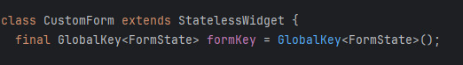

GlobalKey<FormState>는 Form의 상태를 관리하는 데 사용된다. 이를 통해 Form의 상태를 검증하고, Form의 내용을 초기화하거나 저장하는 작업을 수행할 수 있다.

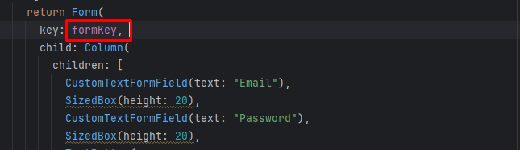

Form 위젯 내부에 자식 위젯으로 TextFormField 를 포함시킨다. Form 위젯의 key 속성으로 GlobalKey를 전달하여 폼 상태를 추적할 수 있다. 

## 5. TextButton 위젯
<aside>
💡 TextButton 위젯은 버튼 중 하나로, 주로 텍스트로만 이루어진 버튼을 만드는 데 사용된다. 버튼의 스타일, 동작, 그리고 레이아웃을 커스터마이징할 수 있다. 

TextButton 위젯의 주요 속성은 다음과 같다.
1. onPressed: 버튼이 눌렸을 때 호출되는 콜백 함수. null로 설정하면 버튼이 비활성화된다.
2. child: 버튼 안에 표시될 위젯. 보통 Text 위젯이 사용되지만, 다른 위젯도 가능하다.
3. style: 버튼의 스타일을 지정한다. TextButton.styleFrom 또는 ButtonStyle을 사용하여 스타일을 설정할 수 있다.
</aside>
 

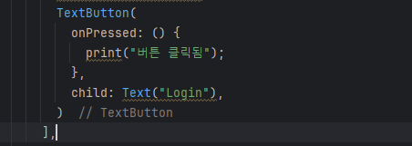

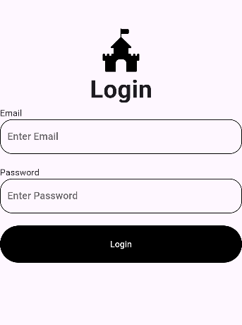

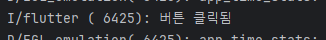

버튼을 누르면 onPressed 함수가 호출되면서 내부가 실행된다.

## 6. Navigator 위젯
<aside>
💡  Navigator는 화면 간의 전환 및 네비게이션을 관리하는 역할을 한다. 앱 내에서 페이지를 추가하거나 제거하고, 그 과정에서 애니메이션을 추가하는 등 다양한 기능을 제공한다. Navigator는 스택(stack) 구조를 사용하여 화면을 관리하며, 각 화면은 스택의 하나의 항목(entry)으로 간주한다.

 
Navigator는 위젯의 주요 메서드는 다음과 같다.

1. push: 새로운 화면을 스택에 추가하고 전환한다.
2. pop: 현재 화면을 스택에서 제거하고 이전 화면으로 돌아간다.
3. pushReplacement: 현재 화면을 새로운 화면으로 교체한다.
4. pushNamed: 이름으로 정의된 경로를 통해 새로운 화면으로 전환합니다. 이는 주로 라우팅을 사용할 때 유용하다.
5. popUntil: 특정 조건이 충족될 때까지 화면을 스택에서 제거한다.
6. canPop: 스택에 이전 화면이 있는지 확인한다.

</aside>
 

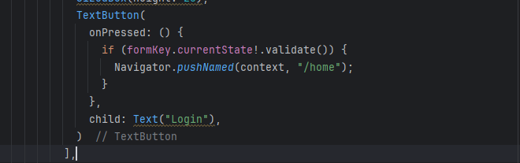

TextButton을 누르면 Navigator.pushNamed 메서드에 의해 라우터에서 지정한 /home 으로 페이지 이동을 한다.

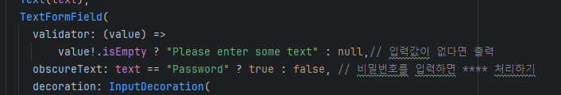

TextFormField 에서 validator 을 활용해 값이 없을 때의 유효성 조건을 설정한다. 그리고 Form위젯의 validate 를 활용해 유효성 검사를 한다.

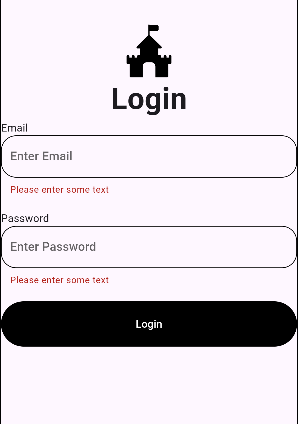

TextFormField 에 빈 값을 넣었을 때 오류 메세지가 뜬다.

값이 입력된 상태에서 버튼을 누르면 페이지 전환이 된다.