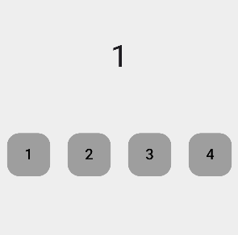

# Chapter 08 쇼핑카드 앱 만들기

### 완성 화면

### 주요 위젯 구성

## 1. StatefulWidget

### 1.1 StatefulWidget이란?
<aside>
💡 플러터에서 StatefulWidget은 상태(state)를 가지는 위젯이다. 이는 사용자가 상호작용할 때나 시간이 지남에 따라 변할 수 있는 데이터를 포함하는 위젯을 만들 때 사용된다. StatefulWidget은 StatelessWidget과 다르게 상태가 변할 수 있는 동적인 위젯이다.

 

StatefulWidget은 두 개의 주요 클래스, 즉 StatefulWidget 자체와 그에 대한 상태(State) 클래스로 구성된다.

1. StatefulWidget 클래스: StatefulWidget은 불변(immutable)이며, 상태가 변할 때마다 새로운 상태 객체를 생성한다.
2. State 클래스: State 클래스는 위젯의 상태를 관리하고, 상태가 변경될 때마다 위젯을 다시 빌드한다.
</aside>
 

### 1.2 StatefulWidget vs StatelessWidget 
<aside>
💡 StatelessWidget은 상태가 없는, 불변의 위젯이다. 한 번 빌드되면 내부 데이터가 변경되지 않으며, UI는 동일하게 유지된다. 따라서 텍스트, 아이콘, 이미지 등 상태 변화가 필요 없는 UI에 사용한다.
</aside>
 

stateless 위젯으 사용한다면 화면은 그릴 수 있으나 버튼을 눌렀을 때 페이지가 변하지 않는다.

<aside>
💡 StatefulWidget은 상태를 가지며, 상태가 변경될 때마다 위젯이 다시 빌드되어 UI가 업데이트된다. 따라서 사용자 입력에 따라 UI가 변경되는 경우 텍스트 입력, 체크박스, 슬라이더 등 동적인 UI에 사용한다.
</aside>

StatefulWidget의 createState 메서드는 State 객체를 생성하고 반환하면서 상태를 관리한다. 버튼의 기본 값을 0으로 지정한다.

 

화면에 표시될 숫자 리스트를 만든다.

버튼에 id 값을 지정한다. 선택된 버튼의 id 값에 따라 상태를 변경하도록 한다.

하지만 변수의 값을 직접적으로 변경하게 되면 앱이 다시 build 되지 않는다. 플러터에서 그림이 다시 그린다는 의미는 build() 함수가 다시 실행된다는 의미이다. 따라서 build() 함수를 호출하기 위해 변수 변경 시 특정 함수를 호출해야 한다.

### 1.3 setState 함수

<aside>
💡 setState는 State 객체의 상태를 변경하고, 변경된 상태에 따라 UI를 다시 빌드하도록 하는 메서드이다. setState 메서드는 주로 사용자 상호작용이나 비동기 작업의 결과에 따라 UI를 업데이트할 때 사용한다.
</aside>
 

버튼을 누르면 setState가 호출되면서 id 값이 바뀌고, 버튼의 색도 변경된다.

그리고 상단에 표시될 숫자의 인덱스도 변경한다.

## 2. 위젯 트리(widget tree)
<aside>
💡 위젯 트리는 우리가 코드로 작성한 위젯들을 트리 형식으로 표현한 것이다. 위젯 트리는 불변의 특성을 가지고 있어 트리가 변경되면 파기됐다가 다시 재생성 된다.
</aside>
 

만약 이런 화면이 있다면 위젯트리는 다음과 같다.

Stateful 위젯의 상태가 바뀌면 Text 의 낮 -> 밤으로 상태가 변경되기를 기대한다.

현재의 위젯 트리에서는 앱이 실행되면 StatefulWidget의 build() 함수가 호출 되면서 1, 2, 3, 4 순으로 화면이 그려진다.
단점은 Text 위젯을 다시 그리기 위해 모든 위젯이 다시 그려지는 일이 발생한다. 

## 3. BuildContext 분리

<aside>
💡 BuildContext는 위젯 트리 내에서 위젯의 위치를 나타내는 클래스이다. build의 뜻은 '건물을 다시 짓다' 라는 뜻이고, context 는 문맥이라는 뜻이다. 뜻을 풀이하면 건물을 짓기 위해 전후 흐름을 알고 있는 클래스라는 의미이다.
위젯트리에서 build() 함수가 실행되는 시점을 변경하면 Text 위젯만 다시 그릴 수 있다.
</aside>
 

그림과 같이 부모 위젯은 stateless 로 변경한 후 Text 위젯 부분을 Stateful 로 설정한다. 이렇게 변경이 필요한 부분을 별도 컴포넌트로 분리하면 새로운 BuildContext가 생성되고, 원하는 Text 부분만 그림을 그릴 수 있다.

## 4. Stack 위젯
<aside>
💡 Stack 위젯은 여러 위젯을 서로 겹쳐서 배치할 수 있는 위젯이다. 각 위젯은 Stack 내에서 쌓여 올라가는 방식으로 배치되며, 위젯을 서로 겹쳐서 배치할 때 유용하게 사용할 수 있다. Stack 위젯은 다양한 레이아웃을 구현할 때, 특히 복잡한 UI를 구성할 때 매우 유용하다.

 
Stack 위젯의 주요 속성은 다음과 같다.

1. children: Stack 위젯 내부에 자식위젯을 포함한다. 첫 번째 위젯이 맨 아래에 위치하고, 마지막 위젯이 맨 위에 한다.
2. alignment: Stack 내에서 자식 위젯들을 어떻게 정렬할지 결정한다. 기본값은 AlignmentDirectional.topStart 이다.
3. fit: Stack의 크기가 자식 위젯들에 의해 결정되는 방식을 정의한다. StackFit.loose가 기본 값이다.
4. overflow: Stack의 경계를 넘어가는 자식 위젯을 어떻게 처리할지 결정한다. 플러터 2.0 이후에는 clipBehavior로 대체되었다.
</aside>
 

Stack 위젯을 사용해 여러 개의 자식 위젯을 겹칠 수 있다.

## 5. Positioned 위젯

<aside>
💡 Positioned 위젯은 Stack 위젯 내에서 자식 위젯의 위치를 지정할 때 사용하는 위젯이다. Stack 위젯은 자식 위젯들을 겹쳐서 배치할 수 있는 컨테이너 역할을 하며, Positioned 위젯을 사용하면 특정 위치에 자식 위젯을 배치할 수 있다.

 
Positioned 위젯의 속성은 다음과 같다.

1. top: 부모 위젯의 상단에서 자식 위젯의 상단까지의 거리. double 타입의 값을 가지며, 지정하지 않으면 기본값은 null이다. 이 속성을 설정하면 자식 위젯이 상단으로부터 떨어진 위치에 배치한다.

2. bottom: 부모 위젯의 하단에서 자식 위젯의 하단까지의 거리. double 타입의 값을 가지며, 지정하지 않으면 기본값은 null이다. 이 속성을 설정하면 자식 위젯이 하단으로부터 떨어진 위치에 배치한다.

3. left: 부모 위젯의 왼쪽에서 자식 위젯의 왼쪽까지의 거리. double 타입의 값을 가지며, 지정하지 않으면 기본값은 null이다. 이 속성을 설정하면 자식 위젯이 왼쪽으로부터 떨어진 위치에 배치한다.

4. right: 부모 위젯의 오른쪽에서 자식 위젯의 오른쪽까지의 거리. double 타입의 값을 가지며, 지정하지 않으면 기본값은 null이다. 이 속성을 설정하면 자식 위젯이 오른쪽으로부터 떨어진 위치에 배치한다.

5. width: 자식 위젯의 너비를 지정한다. double 타입의 값을 가지며, 기본적으로 null이면 자식 위젯의 기본 너비를 사용한다.

6. height: 자식 위젯의 높이를 지정한다. double 타입의 값을 가지며, 기본적으로 null이면 자식 위젯의 기본 높이를 사용한다.
</aside>
 

Positioned 위젯을 사용하면 Stack 의 자식 위젯들의 위치를 조정할 수 있다.

## 6. ClipOval 위젯
<aside>
💡 ClipOval 위젯은 특정 영역을 타원형 또는 원형으로 자르기 위해 사용되는 위젯이다. 자식 위젯을 원형 또는 타원형의 경계 안에 가두어 보여주며, 이때 자식 위젯이 클립되어 경계 밖으로 벗어나지 않도록 한다.
</aside>
 

Container 의 decoration 속성을 사용하지 않아도 Container 위젯을 원형으로 만들 수 있다.

## 7. CupertinoAlertDialog

<aside>
💡 CupertinoAlertDialog는 iOS 스타일의 알림 대화 상자를 생성하는 데 사용되는 함수이다. Cupertino 디자인 언어를 따르며, 일반적으로 iOS 애플리케이션에서 볼 수 있는 모양과 느낌을 제공한다. 플르터는 Skia 엔진 덕분에 MaterialApp 환경에서도 IOS 디자인을 그릴 수 있다.

 
CupertinoAlertDialog의 속성은 다음과 같다.

1. title: 대화 상자의 제목을 표시. 주로 Text 위젯을 사용하여 제목을 설정한다.

2. content: 대화 상자의 본문 내용을 표시. 여기에는 메시지나 설명 텍스트가 들어간다. Text 위젯을 사용하거나 다른 위젯을 조합할 수 있다.

3. actions: 대화 상자의 하단에 표시되는 버튼 목록이다. 각 버튼은 CupertinoDialogAction 위젯으로 정의되며, 사용자가 선택할 수 있는 다양한 옵션을 제공한다.

4. scrollController: 대화 상자 내용이 길어질 때 스크롤을 제어하는 데 사용되는 컨트롤러이다. ScrollController를 사용하여 스크롤 동작을 세밀하게 제어할 수 있다.

5. actionScrollController: 액션(버튼) 영역에 대한 스크롤을 제어하는 컨트롤러이다.
</aside>
 

CupertinoAlertDialog 위젯이 팝업되면 ShoppingCartPage 위젯 위에 팝업이 된다.

따라서 팝업을 사라지게 하려면 Navigator.pop() 함수를 이용해 제거해야 한다.

