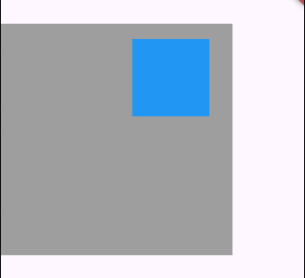

# Chapter 09 모두의 숙소 앱 만들기

### 완성 화면

## 1. double.infinity
<aside>
💡 double.infinity는 Dart 언어에서 사용되는 특수한 상수로, 양의 무한대를 의미한다. Flutter에서 double.infinity는 주로 위젯의 크기를 부모 위젯의 크기에 맞추기 위해 사용된다. 예를 들어, 특정 위젯의 너비나 높이를 double.infinity로 설정하면, 해당 위젯은 가능한 한 최대 크기로 확장된다. 이는 부모 위젯의 제약에 따라 크기가 결정되며, 주어진 공간을 모두 사용하고자 할 때 유용하다.
</aside>
 

## 2. MediaQuery 클래스

<aside>
💡 MediaQuery는 화면의 크기, 해상도, 밝기 등의 정보에 접근할 수 있게 해주는 클래스다. 이를 통해 Flutter 애플리케이션이 실행되는 기기의 화면 크기나 화면의 다양한 특성에 따라 UI를 동적으로 조정할 수 있다. 화면 크기와 해상도, 화면 방향 등을 조정할 수 있다.

 
주요 속성은 다음과 같다.

1. size: 화면의 너비와 높이 정보를 담고 있는 Size 객체.
2. devicePixelRatio: 논리 픽셀과 실제 픽셀 간의 비율. 고해상도 디스플레이에서 유용하게 쓸 수 있다.
3. orientation: 화면이 세로(Orientation.portrait)인지 가로(Orientation.landscape)인지를 나타낸다.
4. padding: 안전 영역에 대한 정보(예: 상태 표시줄, 노치 영역 등을 고려한 패딩).
5. textScaleFactor: 텍스트의 배율을 나타내며, 사용자가 텍스트 크기를 조정한 경우에 유용하다.

</aside>
 

MediaQuery.of(context).size 를 통해 앱의 가로 길이를 디바이스의 가로 길이의 0.7 비율로 설정한다.

이는 다양한 화면 크기에서 동일한 비율로 UI 요소를 표시하여 일관된 사용자 경험을 제공하기 위함이다. 예를 들어, 큰 화면에서는 UI 요소가 너무 넓어지지 않도록 하고, 작은 화면에서는 충분한 너비를 확보하도록 조정할 수 있다.

