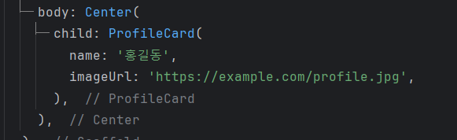
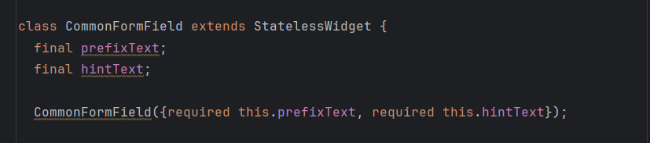
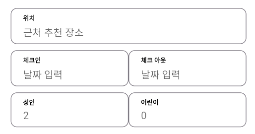
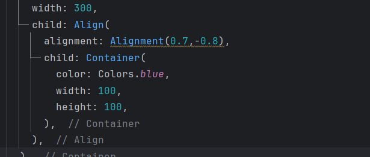

# Chapter 09 모두의 숙소 앱 만들기

### 완성 화면

## 1. double.infinity
<aside>
💡 double.infinity는 Dart 언어에서 사용되는 특수한 상수로, 양의 무한대를 의미한다. Flutter에서 double.infinity는 주로 위젯의 크기를 부모 위젯의 크기에 맞추기 위해 사용된다. 예를 들어, 특정 위젯의 너비나 높이를 double.infinity로 설정하면, 해당 위젯은 가능한 한 최대 크기로 확장된다. 이는 부모 위젯의 제약에 따라 크기가 결정되며, 주어진 공간을 모두 사용하고자 할 때 유용하다.
</aside>
 

double.infinity 를 사용하면 부모 위젯의 크기 만큼 공간을 차지한다.

## 2. MediaQuery 클래스

<aside>
💡 MediaQuery는 화면의 크기, 해상도, 밝기 등의 정보에 접근할 수 있게 해주는 클래스다. 이를 통해 Flutter 애플리케이션이 실행되는 기기의 화면 크기나 화면의 다양한 특성에 따라 UI를 동적으로 조정할 수 있다. 화면 크기와 해상도, 화면 방향 등을 조정할 수 있다.

 
주요 속성은 다음과 같다.

1. size: 화면의 너비와 높이 정보를 담고 있는 Size 객체.
2. devicePixelRatio: 논리 픽셀과 실제 픽셀 간의 비율. 고해상도 디스플레이에서 유용하게 쓸 수 있다.
3. orientation: 화면이 세로(Orientation.portrait)인지 가로(Orientation.landscape)인지를 나타낸다.
4. padding: 안전 영역에 대한 정보(예: 상태 표시줄, 노치 영역 등을 고려한 패딩).
5. textScaleFactor: 텍스트의 배율을 나타내며, 사용자가 텍스트 크기를 조정한 경우에 유용하다.

</aside>
 

MediaQuery.of(context).size 를 통해 앱의 가로 길이를 디바이스의 가로 길이의 0.7 비율로 설정한다.

이는 다양한 화면 크기에서 동일한 비율로 UI 요소를 표시하여 일관된 사용자 경험을 제공하기 위함이다. 예를 들어, 큰 화면에서는 UI 요소가 너무 넓어지지 않도록 하고, 작은 화면에서는 충분한 너비를 확보하도록 조정할 수 있다.

## 3. 선택적 매개변수(Named Parameter)
<aside>
💡 선택적 매개변수(Named Parameter)는 Dart의 문법으로, 생성자는 중괄호 {} 를 사용해 매개변수를 받을 수 있다. 함수 호출 시 매개변수의 이름을 명시해서 값을 전달할 수 있다. 명명된 매개변수는 기본적으로 선택적이지만, 필수로 만들고 싶다면 required 키워드를 사용할 수 있다.
</aside>
 

클래스의 생성자에 중괄호를 표기한다. 꼭 받아야할 변수는 required, 받기를 선택할 수 있는 변수는 변수 타입에 ? 를 붙여 nullable(null이 될 수 있음) 상태로 만든다.

선택적 매개변수를 사용해면 부모 위젯에서 변수를 전달받을 때 키 : 값의 형태로 전달받을 수 있고, 원하는 값을 선택적으로 받을 수 있어 편리하다.

<aside>
💡 이렇게 부모 위젯에서 자식 위젯으로 변수를 전달받는 방식으로 구성하게 되면, 공통된 컴포넌트를 만든 후 컴포넌트에 변수만 전달하면 되기 때문에 코드가 더욱 간결해진다.
</aside>
 

공통 formField를 만든 후 변수를 선택적 매개변수로 받는다.

부모 위젯은 같은 컴포넌트에 변수만 다른 값을 전달한다.

하나의 컴포넌트를 활용해 화면을 구성할 수 있다.

## 4. Align 위젯
<aside>
💡 Align 위젯은 Flutter에서 자식 위젯의 정렬을 조정하는 데 사용된다. Align 위젯은 alignment 속성을 통해 자식 위젯이 부모 위젯 내에서 어디에 위치할지를 결정한다.

 
Align 위젯의 주요 속성은 다음과 같다.

1. alignment: 자식 위젯을 부모의 어떤 위치에 배치할지를 정의한다. Alignment 객체를 사용하여 정의되며, 기본적인 값으로는 Alignment.center, Alignment.topLeft, Alignment.bottomRight 등이 있다.

2. widthFactor: 부모 위젯의 너비를 자식 위젯의 너비에 맞추는 요소. 값이 null이면, 부모 위젯은 가능한 최대 너비를 차지하게 된다. 값이 1이면, 부모 위젯의 너비는 자식 위젯의 너비와 동일하게 설정된다.

3. heightFactor: widthFactor와 유사하게, 부모 위젯의 높이를 자식 위젯의 높이에 맞추는 요소.
</aside>
 

Alignment 의 기본 값으로 배치할 수 있다.
 

자식 위젯의 위치를 직접 지정할 수도 있다.

삼항연산자를 사용해 디바이스의 가로 길이가 변경됐을 자식 위젯의 위치를 동적으로 변경할 수 있다.

 

사이즈가 클 때는 부모 위젯의 왼쪽에 위치하지만 사이즈가 줄어들면 부모 위젯의 가운데에 위치하도록 한다.

## 5. Wrap 위젯
<aside>
💡 Wrap 위젯은 Flutter에서 자식 위젯들을 자동으로 다음 줄로 넘겨 배치하는 데 사용되는 레이아웃 위젯이다. 이는 자식 위젯들이 수평 또는 수직 방향으로 오버플로우할 때 유용하며, 그리드 레이아웃과 유사한 방식으로 요소들을 배치할 수 있다.

Wrap 위젯은 Row와 Column의 기능을 결합한 형태로 볼 수 있으며, 자식 요소들이 지정된 방향으로 가득 차면 다음 줄이나 열로 이동하여 배치된다.

Wrap 위젯의 주요 속성은 다음과 같다.

1. direction: Wrap 위젯의 주 축 방향을 설정한다. 기본값은 Axis.horizontal로, 수평 방향으로 자식 위젯을 배치합니다. 수직 방향으로 배치하려면 Axis.vertical을 사용한다.

2. alignment: 주 축 방향에서 자식 위젯들의 정렬 방식을 결정한다. 예를 들어, WrapAlignment.start, WrapAlignment.center, WrapAlignment.end 등을 사용할 수 있다.

3. spacing: 주 축 방향에서 자식 위젯들 사이의 간격을 설정한다.

4. runAlignment: Wrap 위젯의 교차 축에서 줄 또는 열의 정렬 방식을 설정한다.

5. runSpacing: 교차 축에서 줄 또는 열 간의 간격을 설정한다.

6. children: Wrap 위젯의 자식 위젯을 담는다.
</aside>
 

자식 위젯을 Row로 배치하면 가로 길이가 작아졌을 때 overflowed 오류가 발생하게 된다.

Wrap 위젯을 사용하면 사이즈가 줄어도 자동으로 교차 축 정렬이 된다.

